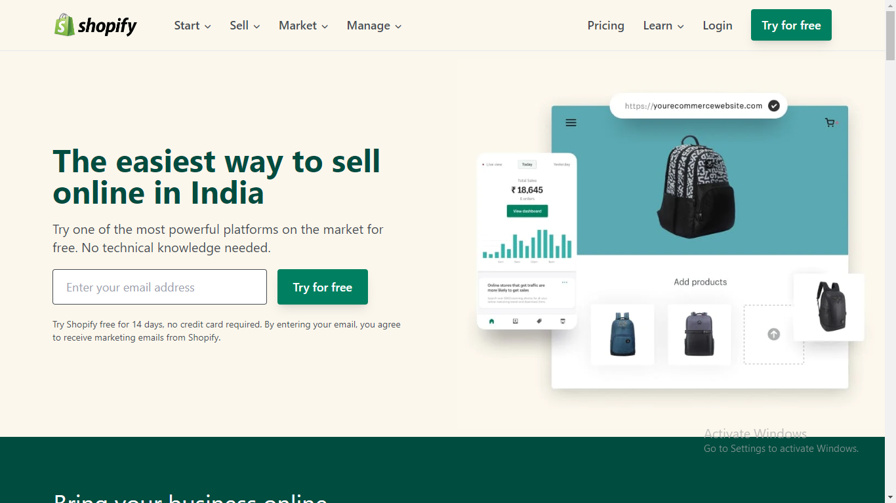

# Shopify Website Clone

## 0. Table of contents

1. [Overview](#1-overview)
2. [Components of the website](#2-components-of-the-website)
3. [Live Deployment](#3-live-deployment)
4. [Demo Video](#4-demo-video)

## 1. Overview

This project is a static clone of Shopify website. It is built using HTML and Tailwind CSS and is responsive for both mobile and tablet screens.

## 2. Components of the website

This website is divided into following sections :-

- Navigation bar
- Hero section
- Bring your business online section
- Offered services section
- Explore more section
- Empowering business owners section
- Get help section
- Free trial section
- Footer

## 3. Live Deployment

Clone of Shopify website is deployed on Vercel. To visit the live deployment, [click here](https://shopify-clone-beige.vercel.app/).

## 4. Demo Video

Demo video of the project is uploaded on youtube. To watch the demo video, [click here](https://youtu.be/MK_tpxLLMNQ).

